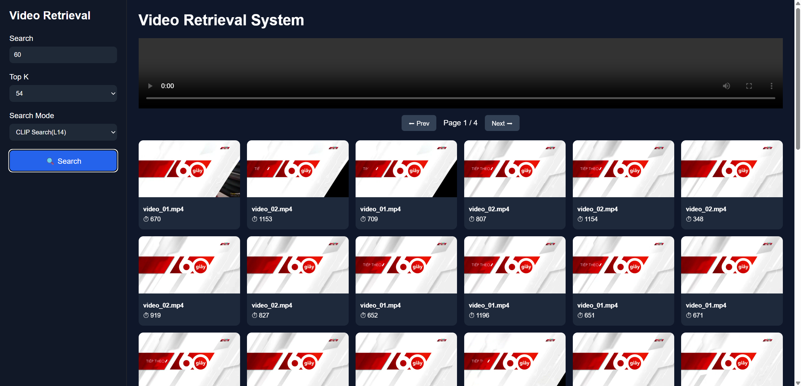
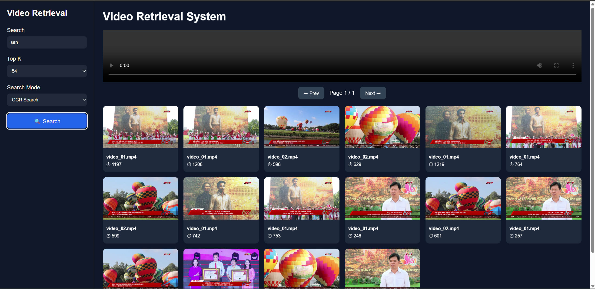
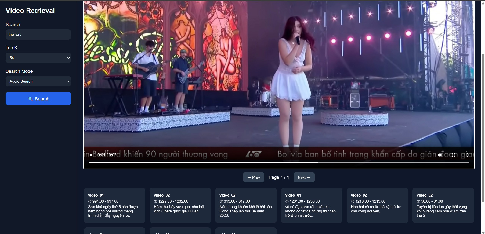

# Video Retrieval System

Ứng dụng tìm kiếm video theo 3 chế độ:

- **CLIP Search**: Tìm frame theo mô tả bằng ngôn ngữ tự nhiên.
- **OCR Search**: Tìm frame dựa trên văn bản xuất hiện trong hình ảnh.
- **Audio Search**: Tìm đoạn audio/phụ đề dựa trên nội dung lời nói.

## Home

## CLIP Search




## OCR Search



## Audio Search



Project gồm backend Flask, frontend HTML/CSS/JavaScript và dữ liệu frame/index đã được xử lý sẵn.

## Cấu trúc thư mục

```text
.
+-- backend/
|   +-- app.py              # Flask API server
|   +-- search.py           # Logic tìm kiếm CLIP, OCR, Audio
|   +-- data/
|       +-- bin/
|       |   +-- all_videos.bin      # FAISS index cho CLIP
|       |   +-- all_metadata.json   # Metadata frame
|       |   +-- ocr.json            # Metadata OCR
|       |   +-- audio.json          # Metadata Audio
|       +-- video_01/               # Frame ảnh của video 01
|       +-- video_02/               # Frame ảnh của video 02
+-- frontend/
|   +-- index.html          # Giao diện chính
|   +-- app.js              # Gọi API và hiển thị kết quả
|   +-- style.css           # Giao diện CSS
+-- data/                   # Dữ liệu và frame hỗ trợ
+-- video/                  # File video gốc
+-- *.ipynb                 # Notebook xử lý dữ liệu
```

## Yêu cầu môi trường

- Python 3.10 trở lên
- Trình duyệt web
- Khuyến nghị có GPU CUDA nếu muốn tăng tốc CLIP Search

Các thư viện Python chính:

- `flask`
- `flask-cors`
- `faiss-cpu` hoặc `faiss-gpu`
- `torch`
- `openai-clip`
- `googletrans`

## Cài đặt

Tạo môi trường ảo:

```bash
python -m venv .venv
```

Kích hoạt môi trường ảo trên Windows:

```bash
.venv\Scripts\activate
```

Cài đặt các thư viện cần thiết:

```bash
pip install flask flask-cors faiss-cpu torch googletrans==4.0.0-rc1
pip install git+https://github.com/openai/CLIP.git
```

Nếu sử dụng CUDA, hãy cài đặt `torch` theo đúng phiên bản CUDA từ trang PyTorch trước khi chạy project.

## Chạy Backend

Backend cần được chạy từ thư mục `backend` vì chương trình đọc dữ liệu theo đường dẫn tương đối `data/bin/...`.

```bash
cd backend
python app.py
```

Mặc định API sẽ chạy tại:

```text
http://127.0.0.1:5000
```

Lần chạy đầu tiên có thể mất một khoảng thời gian do hệ thống cần tải model CLIP `ViT-L/14` và đọc FAISS index.

## Chạy Frontend

Mở file sau bằng trình duyệt:

```text
frontend/index.html
```

Frontend sẽ gửi yêu cầu trực tiếp tới:

```text
http://127.0.0.1:5000
```

Vì vậy, cần đảm bảo backend đã được khởi động trước khi thực hiện tìm kiếm.

## API Endpoints

### CLIP Search

```http
GET /search?q=<query>&page=1&topk=50
```

Trả về danh sách các frame phù hợp với mô tả đầu vào. Nếu truy vấn bằng tiếng Việt, hệ thống sẽ sử dụng `googletrans` để dịch sang tiếng Anh trước khi mã hóa bằng CLIP.

### Lấy frame lân cận

```http
GET /clip/context?video=<video>&timestamp=<time>&window=20
```

Trả về các frame trước và sau timestamp được chọn. Frontend sử dụng endpoint này khi người dùng nhấp vào một frame trong kết quả tìm kiếm.

### OCR Search

```http
GET /ocr?q=<query>&page=1&topk=50
```

Tìm kiếm frame dựa trên nội dung OCR được lưu trong `backend/data/bin/ocr.json`.

### Audio Search

```http
GET /audio?q=<query>&page=1&topk=50
```

Tìm kiếm các đoạn audio/phụ đề dựa trên transcript trong `backend/data/bin/audio.json`.

## Lưu ý

- Dữ liệu index và metadata phải tồn tại trong thư mục `backend/data/bin`.
- Ảnh frame được phục vụ thông qua endpoint `/data/<path>` của Flask.
- CLIP Search sử dụng model `ViT-L/14`, vì vậy thời gian tìm kiếm sẽ chậm hơn trên các máy không có GPU.
- `googletrans` phụ thuộc vào dịch vụ dịch bên ngoài. Nếu quá trình dịch thất bại, hệ thống sẽ sử dụng truy vấn gốc để tìm kiếm.
- Hiện tại địa chỉ API trong `frontend/app.js` đang được hard-code là `http://127.0.0.1:5000`.
